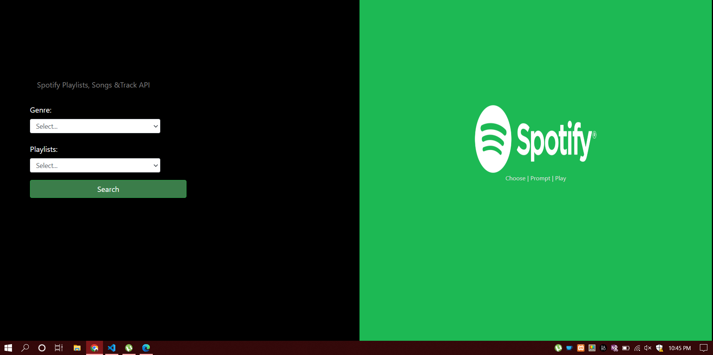
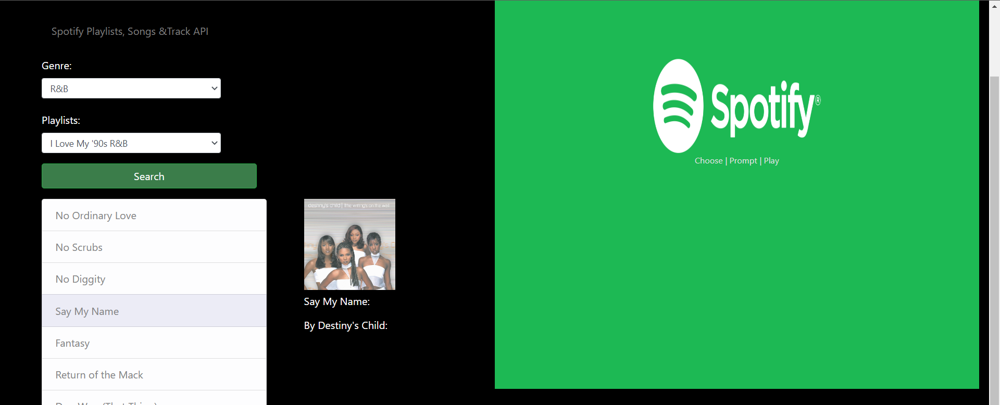

# Spotify API implmentation.

- Through youtube tutorial , I was able to create this spotify mini app.
- The app sifts through tokens and endpoints.

> Client Id : Your own provided id 
> Client Secret: Provided too after creating applications on developers page.

- On app start, it will generate an access **token**. 
- This will be used as paramaters in which to connect to other endoints.
- It's like the entry point to other REST methods i.e  GET, PUT, POST DELETE.

### app.js
This is the functionality of the application .It has :
- APIp Controller - This controls the private methods(functions of the API )
- UI Controller - This connects the html of the app and the js of the page. 
    - It also initiates token generation and save onSubmit();
- APP Controller. Controls both API and UI. Has event listeners that listen to clicks and executes functions.

### index.html
- This is the user interface of the page.

### styles
- This holds the styles of the page.

## What it does ,
It prompts you to select from a list of genres, and then playlists in that particular genre.
Then displays lists of songs in that playlist, then will display a song's info on the side. See below:

## *FOR NOW*

